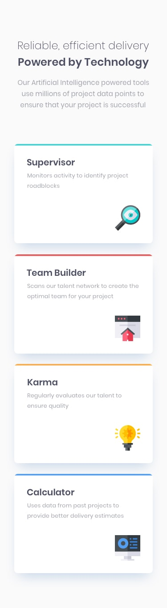

# Frontend Mentor - Four card feature section solution

This is a solution to the [Four card feature section challenge on Frontend Mentor](https://www.frontendmentor.io/challenges/four-card-feature-section-weK1eFYK). Frontend Mentor challenges help you improve your coding skills by building realistic projects. 

## Table of contents

- [Overview](#overview)
  - [The challenge](#the-challenge)
  - [Screenshot](#screenshot)
  - [Links](#links)
- [My process](#my-process)
  - [Built with](#built-with)
  - [What I learned](#what-i-learned)
  - [Continued development](#continued-development)
  - [Useful resources](#useful-resources)
- [Author](#author)
- [Acknowledgments](#acknowledgments)

## Overview

### The challenge

Users should be able to:

- View the optimal layout for the site depending on their device's screen size

### Screenshot
#### The challenge screenshots
##### Desktop

##### Mobile

#### The solution Screenshots
##### Desktop

##### Mobile

### Links

- Solution URL:(https://github.com/rankobinu/Trying-to-mastering-responsivness)
- Live Site URL:(https://rankobinu.github.io/Trying-to-mastering-responsivness/)

## My process

### Built with

- Semantic HTML5 markup
- CSS custom properties
- Flexbox
- Mobile-first workflow
- SCSS

### What I learned

In this challenge i have learned more how to make my code esponsive and for that i have taken Kevin Powel 21day course

### Continued development

I'll continue learning more about Grid and Flexbox

## Author

- Frontend Mentor - [@rankobinu](https://www.frontendmentor.io/profile/rankobinu)

